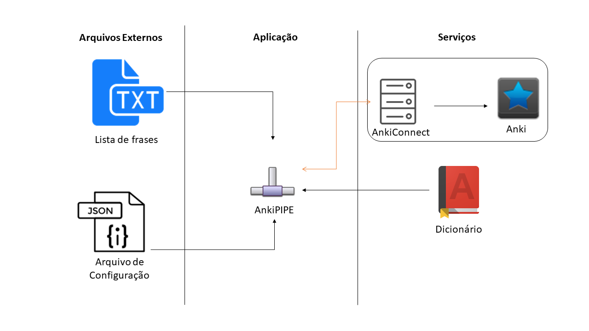
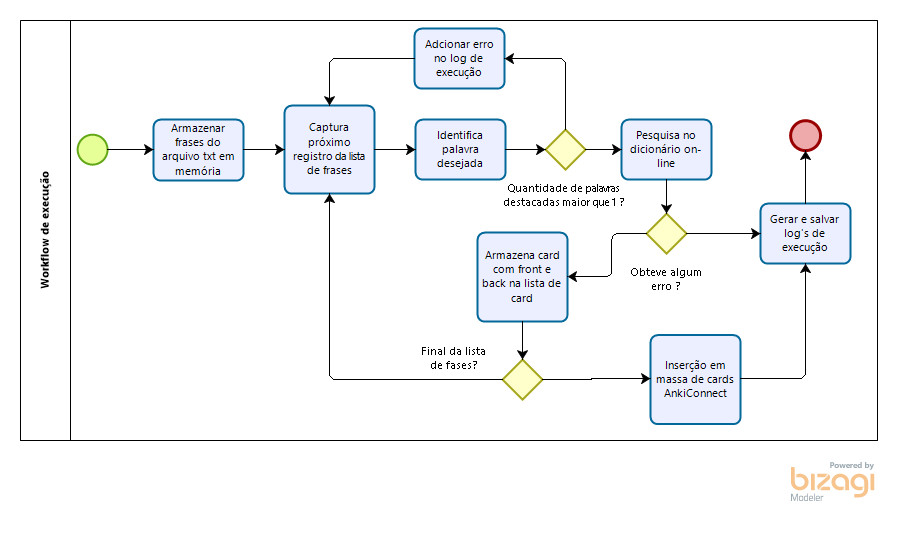

# AnkiPIPE

Ultilizo o anki, software de repetição espaçada para estudar inglês. Possuo um deck somente para treinar o vocabulário da língua inglesa, nos cards costumo deixar uma frase com somente uma palavra que ainda não saiba o significado destacada na parte da frente e seu significado, exemplos de utilização e transcrição fonética na parte de trás.

Adicionar frases no anki para manter os estudos em dia consome um tempo que cada vez está mais escasso na minha rotina. Desta maneira, desenvolvo este projeto AnkiPIPE para que ajude não somente a mim, mas também todos interassados em utilizar a solução.

**Escopo:**

Através de uma lista de frases em um arquivo de extensão txt, com a palavra não entendida entre !PALAVRA!, o software irá pesquisar a palavra em um dicionário online utilizando técnicas de Web Scraping retornando seu significado, exemplos de utilização e transcrição fonética. Sendo assim, com estes dados em mãos a aplicação irá cadastrá-las no Anki através de um plugin, AnkiConnect, que quando instalado no Anki, faz com que o mesmo seja capaz de realizar interações através de um WebService RESTful.
Antes de finalizar a execução, um log deverá ser salvo na máquina.

**Restrições do Escopo:**
* No momento da execução da aplicação o Anki deve estar aberto e com o plugin AnkiConnect configurado;
* A aplicação somente faz o cadastro de novos cards, não realiza nenhum tipo de manipulação dos decks ou cards;

**Componentes:**
* Aplicação AnkiPIPE
* WebSite - Collins Dictionary
* Web Api - AnkiConnect

**Componentes Auxiliares:**
* Arquivo de listas

**Regras de Negócio**
1. Toda palavra entre !PALAVRA! deve ser pesquisada no dicionário;
2. Frases com mais de uma palavra entre |PIPE| não devem ser processadas;
3. Ao pesquisar uma palavra no dicionário, o significado, exemplos de utilização e transcrição fonética devem ser recuperados;
4. Toda frase com palavra já consultada deve ser cadastrada em um card;
5. Um card reflete em somente uma frase e palavra;
6. Ao final da execução, um log txt deve ser gerado e salvo na máquina;

**Requisitos Funcionais**
1. Ao iniciar a execução, a aplicação deve consultar a lista de frases com palavras não entendidas;
2. A aplicação pesquisará o significado de cada palavra entre !PALAVRA!, caso tenha mais de uma palavra destacada somente a primeira será processada;
3. Caso a frase não tenha nenhuma palavra destacada, não será adicionada e será descrito no log
4. A aplicação deverá gerar um log de sua execução;

**Requisitos Não-Funcionais**
1. A pesquisa de palavras entre !PALAVRA! deverá ser realizada via Regular Expression;
2. A máquina no momento da execução da aplicação devera estar conectada à internet, estar executando o Anki com o plugin AnkiConnect devidamente configurado e também ter o Node.JS instalado;
    
**Detalhamento Técnico:**
* Linguagem de Programação: Javascript (node.js);
* Técnicas de Programação: Test-Driven-development (TDD);
* Padrão API: REST;

**Workflow de Execucao:**

