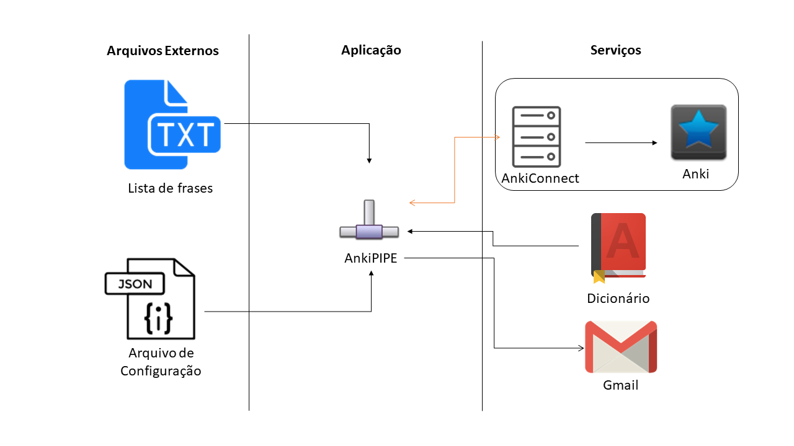
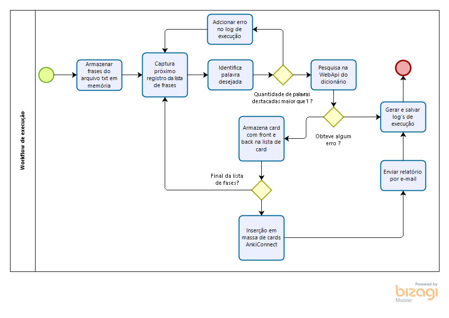

# AnkiPIPE

Ultilizo o anki, software de repetição espaçada para estudar inglês. Possuo um deck somente para treinar o vocabulário da língua inglesa, nos cards costumo deixar uma frase com somente uma palavra que ainda não saiba o significado destacada na parte da frente e seu significado, exemplos de utilização e transcrição fonética na parte de trás.

Adicionar frases no anki para manter os estudos em dia consome um tempo que cada vez está mais escasso na minha rotina. Desta maneira, desenvolvo este projeto AnkiPIPE para que ajude não somente a mim, mas também todos interassados em utilizar a solução.

**Escopo:**

Através de uma lista de frases em um arquivo de extensão txt, com a palavra não entendida entre |PIPE|, o software irá pesquisar a palavra em um WebService do Oxford Dictionary retornando seu significado, exemplos de utilização e transcrição fonética. Sendo assim, com estes dados em mãos a aplicação irá cadastrá-las no Anki através de um plugin, AnkiConnect, que quando instalado no Anki, faz com que o mesmo seja capaz de realizar interações através de um WebService RESTful.
Algumas informações sobre o ambiente da máquina do usuário deverão ser inseridas em um arquivo JSON em um local definido.
Antes de finalizar a execução, um log deverá ser salvo na máquina e um relatório deverá ser enviado por e-mail.

**Restrições do Escopo:**
* O dicionário utilizado pela aplicação não pode ser alterado;
* Para o correto funcionamento da aplicação o arquivo de configuração JSON deve estar corretamente configurado;
* No momento da execução da aplicação o Anki deve estar aberto e com o plugin AnkiConnect configurado;
* A aplicação somente faz o cadastro de novos cards, não realiza nenhum tipo de manipulação dos decks ou cards;

**Componentes:**
* Aplicação AnkiPIPE
* Web Api - Oxford Dictionary
* Web Api - AnkiConnect

**Componentes Auxiliares:**
* Arquivo de listas
* Arquivo de configuração JSON

**Regras de Negócio**
1. Toda palavra entre |PIPE| deve ser pesquisada no dicionário;
2. Frases com mais de uma palavra entre |PIPE| não devem ser processadas;
3. Ao pesquisar uma palavra no dicionário, o significado, exemplos de utilização e transcrição fonética devem ser recuperados;
4. Toda frase com palavra já consultada deve ser cadastrada em um card;
5. Um card reflete em somente uma frase e palavra;
6. Ao final da execução, um log txt deve ser gerado e salvo na máquina;
7. Ao final da execução, um relatório deve ser enviado por e-mail;
8. O relatório deve conter o deck, quantidade de cards, a meta do ano, quantidade para alcançar a meta, média para alcançar a meta;

**Requisitos Funcionais**
1. Ao iniciar a execução, a aplicação deve consultar a lista de frases com palavras não entendidas;
2. A aplicação pesquisará o significado de cada palavra entre |PIPE|, caso tenha mais de uma palavra, a linha será abortada, incluindo no log de execução que determinada frase tem mais de uma palavra não entendida e não pode ser processada;
3. Caso a frase não tenha nenhuma palavra destacada, aplicar o mesmo tratamento de palavras não entendidas desejadas;
4. O local de pesquisa da lista de frases, o sync após o cadastro, o baralho em que as frases serão consultadas, credenciais e destinatário do relatório serão consultados no arquivo de configuração JSON;
5. A aplicação deverá gerar um log de sua execução;
6. Após adicionar os novos cards, a aplicação deve enviar um e-mail informando: o deck, quantidade de cards, a meta do ano, quantidade para alcançar a meta, média para alcançar a meta;
7. Caso o sync esteja ativado no arquivo de configuração, enviar comando de sync para o AnkiConnect;

**Requisitos Não-Funcionais**
1. A pesquisa de palavras entre |PIPES| deverá ser realizada via Regular Expression;
2. A máquina no momento da execução da aplicação devera estar conectada à internet, estar executando o Anki com o plugin AnkiConnect devidamente configurado e também ter o Node.JS instalado;
3. Para a correta execução da aplicação, o arquivo JSON deverá estar configurado adequadamente;

**Parametrização do Arquivo de Configuração:**
<table>
        <tr>
            <th>Campo</th>
            <th>Descrição</th>
        </tr>
        <tr>
            <td>LocalLista</td>
            <td>Local da lista em que as frases ficarão armazenadas</td>
        </tr>
        <tr>
            <td>Sync</td>
            <td>Sim ou não para indicar se após a execução a aplicação deve ou não realizar a sincronização</td>
        </tr>
        <tr>
            <td>Baralho</td>
            <td>O baralho em qual os cards devem ser cadastrados</td>
        </tr>
        <tr>
            <td>Destinatário do e-mail</td>
            <td>E-mail para qual o relatório será enviado</td>
        </tr>
        <tr>
            <td>e-mail</td>
            <td>E-mail que será utilizado para a aplicação enviar os relatórios</td>
        </tr>
        <tr>
            <td>senha</td>
            <td>Senha do e-mail que a aplicação utilizará para enviar os relatórios</td>
        </tr>
        <tr>
            <td>localLog</td>
            <td>Local onde o arquivo txt referente ao log será salvo</td>
        </tr>
        <tr>
            <td>api_id</td>
            <td>id fornecido pela api do dicionário Oxford</td>
        </tr>
        <tr>
            <td>app_key</td>
            <td>key fornecida pela api do dicionário Oxford</td>
        </tr>
        <tr>
            <td>url_AnkiConnect</td>
            <td>Endereço do servidor em que o Anki está sendo executado</td>
        </tr>
        <tr>
            <td>port_AnkiConnect</td>
            <td>Porta utilizada pelo servidor em que o Anki está sendo executado</td>
        </tr>
    </table>
    
**Detalhamento Técnico:**

* Linguagem de Programação: Javascript (node.js);
* Técnicas de Programação: Test-Driven-development (TDD);
* Padrão API: REST;

**Workflow de Execucao:**

